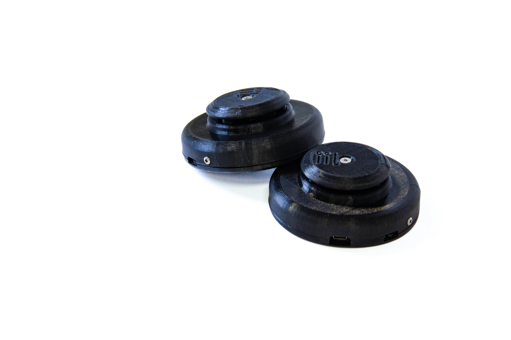
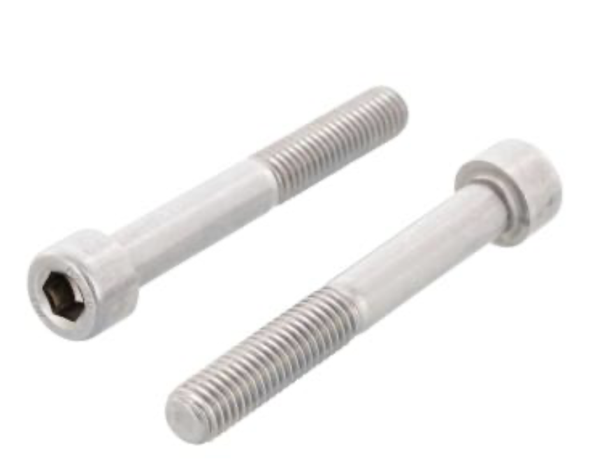
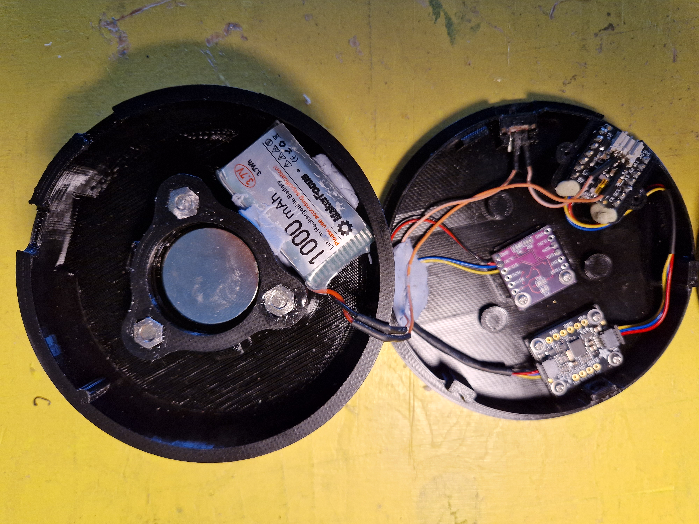

# Thales
Software, 3D model and printing files, hardware specs and instructions for building Thales.

  

Hardware: 
- 1x Receiver: Esp32 TTGO V7 1.3 Mini - you can use any ESP32 board with a decent antenna.
- 2x Sender (on board microcontrollers): Adafruit ESP32 Pico Stemma QT - S2 (avoid S3 due to incompatibility with the BNO055) (https://www.adafruit.com/product/5325)
- 2x Battery Charger shields for Stemma QT (https://www.adafruit.com/product/5397)
- 2x Adafruit BNO055 (https://www.adafruit.com/product/4646)
- Taidacent MLX90393 (with few mods should easily host the Adafruit version)
- 4x Stemma QT I2C wires
- 2x SPDT Switch: https://www.adafruit.com/product/805
- Set of neodymium magnets, 30mm diameter (4mm thick ones, but also 5mm is fine)
- 2x LiPo batteries (I used Makerfocus batteries: https://www.makerfocus.com/products/4pcs-952540-3-7v-1000mah-battery-with-jst1-25-connector-lithium-rechargeable-battery)
- Screws and bolts of various sizes, possibly non ferromagnetic. Importantly, 6x half thread screws such as these, with nuts:

  

  
Heres's one assembled controller. Building process will be detailed as I replicate it in the next weeks:

 

